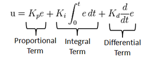
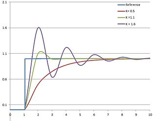

# PID Controller
Self-Driving Car Engineer Nanodegree Program

---

[youtube_link](https://www.youtube.com/watch?v=vJW2Oj18J2g&feature=youtu.be)

## PID Controller
The Proportional Integral derivative controller is a highly robust controller used
in large number of control systems applications.

where
`r(t)` is the input/desired state

`y(t)` is the current state

`u(t)` is the control signal

`e(t) = r(t)-y(t)` is the error in states

### P controller
The output signal varies proportional to the input signal
`u = Kp*e`. proportional controllers tend to oscillate and do not converge to a value.

### PD controller
To make the controller converge faster, derivative of error is used with the P controller. 
PD Controllers `u = Kp*e + Kd*(de/dt)`

### PID Controller
For and controller, the step response needs to converge in 2% to 5% of the error margin. 
It is difficult to tune PD Controllers to such a precision. By summing up the errors over time,
the oscillations are damped to make the signal conerge in the given error margin.

Following is the PID equation

Here we need to tune `Kp`, `Ki`, `Kd` to achieve a step response

## Tuning PID Controller
The Car controller has 2 PID controllers, one for steering and one for throttle. 
The PID Gains were manually tune by first keeping the throttle constant and vary 
Kp_steering to keep the car on track. Later Kd_steering was changed to keep the 
car centered but it still oscillated. Ki_steering was then tuned to reduce those 
oscillations. Similar parameters were used as initial gains for throttle controller
and observed if the car slows down while turning and accelerates on the road. Then 
the steering was were again fine tuned with dynamic throttle to achieve good control. 

Final Gains

|Controller | Kp  | Ki | Kd |
|---|---|---|---|
|Steering| 0.08  | 0.0005  | 1.0  |
|Throttle| 0.40  | 0.0020  | 15.8  |

checkout [wikipedia](https://en.wikipedia.org/wiki/PID_controller) for more detail

---

## Code
This code talks with the Udacity Simulator over webSocket over port 1234

### `src/main.cpp`
This is the main file which has web Socket handlers and creates a client and connects to the simulator

### `src/Utils.cpp`
This file contains util functions and a *CarController* class.
The *CarController* class implements two pid controllers, one for steering and one
for throttle. It takes a json object and parses the states obtained from the simulator.
the *processController* is a higher level controller method which uses both the pid
controllers to generate a `u(t)` as a json.

### `src/PID.cpp`
This file implements a simple pid controller which is then used by CarController.
